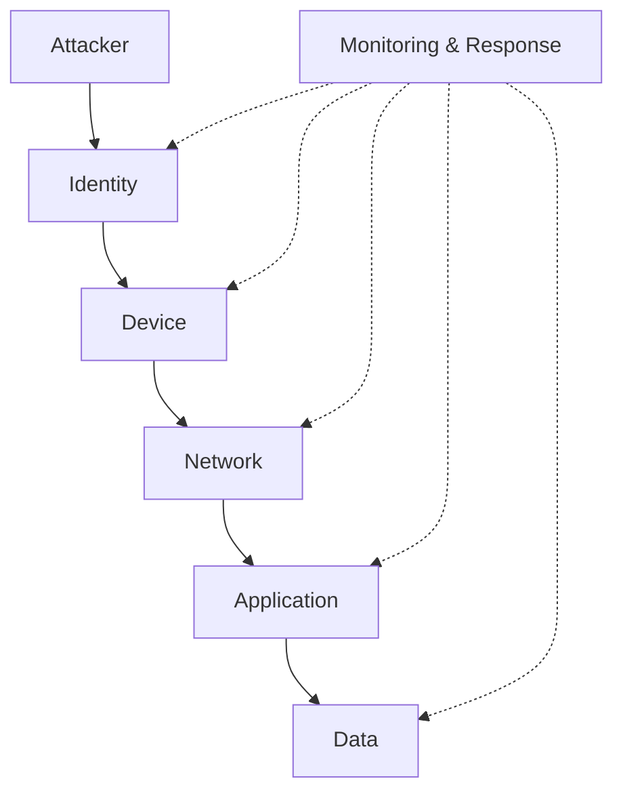
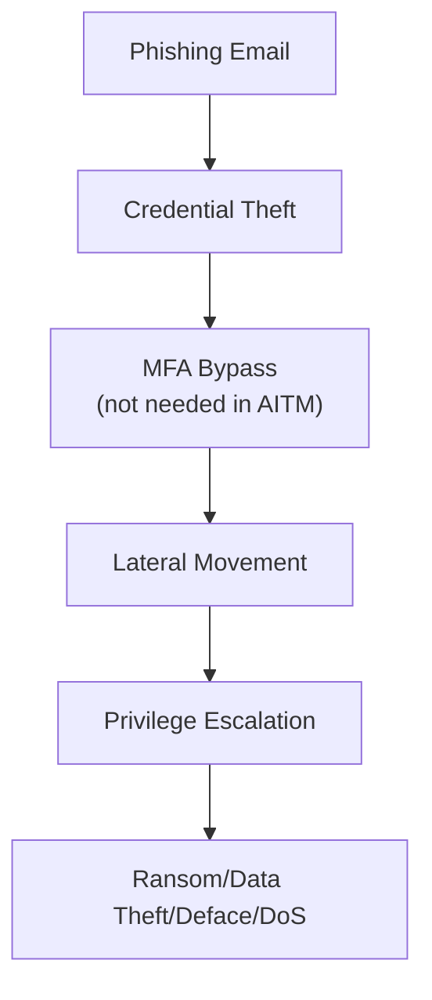

## Overview

Defense in Depth is the practice of implementing multiple independent layers of protection so that the failure of any single control does not result in a system compromise.
It is not enough to stop once you have implemented a single security measure.

!!! danger "Core assumption of Defense in Depth"
    Every security control can fail, and in unexpected ways.

    Which is an extension of the [Principle of Assume Breach](0-AssumeBreach.md){:data-preview}.

For example:

- A firewall can be misconfigured.
- A user can fall for phishing.
- An administrator can make a mistake.
- A developer can introduce a weakness/CWE.
- A monitoring system can miss an alert.

Because individual controls are imperfect, systems should be designed so that multiple controls must fail before a significant impact occurs.

Rather than relying on a single protection mechanism, Defense in Depth introduces overlapping safeguards across people, processes, architecture, infrastructure, applications, identities, and data.
This approach creates friction for attackers while simultaneously reducing the blast radius of failures.

## Layers Matter More Than Products

Defense in Depth is often mistakenly implemented as a collection of security products.

Buying more tools does not automatically improve security.

The goal is not:

- More software.
- More alerts.
- More vendors.
- More complexity.

The goal is:

- Independent protections.
- Interconnected detections.
- Reduced attack paths.
- Reduced blast radius.
- Faster detection.
- Faster recovery.

A well-designed architecture with fewer tools is often more secure than a complex architecture having dozens of poorly integrated products.

## Defense in Depth Is an Engineering Principle

Many engineers think of Defense in Depth as a cybersecurity concept.

While security teams often discuss it, the principle applies equally to engineering disciplines:

| Discipline | Example |
|------------|----------|
| Software Engineering | Input validation, authorization checks, secure APIs, runtime monitoring |
| Cloud Engineering | Landing zones, network segmentation, managed identities, policy enforcement |
| Infrastructure Engineering | Hardened operating systems, host firewalls, remote administration controls |
| Systems Engineering | Redundancy, fault isolation, change control, disaster recovery |
| Security Engineering | Detection, prevention, containment, response |

Successful engineering organizations do not rely on a single organization, control, service, or assumption. 
Instead, systems are designed so that failure stays manageable.

## Thinking Like an Attacker

Attackers rarely compromise systems through a single action.
Most compromises are chains of events. 
For example:

## Examples

### Physical

Physical access often bypasses logical security controls.

- Secured facilities.
- Locked server rooms.
- Hardware protections.
- Video surveillance.
- Physical access controls.

Physical security is still relevant in cloud environments because providers implement extensive physical protections for their datacenters. 

!!! Warning "Cloud Physical Security"
    It is critical to validate that your cloud providers have implemented strong physical security controls.

### Identity

Identity has always been the primary security boundary. 
It hasn't been until recently that technology has become available to implement strong identity protections at scale.

!!! info
    The people who invented the network/firewall perimeter approach even made the concession that the firewall approach was the best that was possible in the early 2000s with the current technology.

Examples include:

- Multi-factor authentication.
- Password-less authentication.
- Conditional access.
- Risk-based authentication.
- Identity governance.
- Privileged Identity Management.
- Privileged Isolation.

Many modern attacks target identities instead of infrastructure as it is much easier to compromise a single identity than to compromise an entire server or network. 
Protecting identities is often more valuable than protecting individual servers due to simpler security configurations giving higher return on investment.

### Endpoint

Endpoints are the environment where users and administrators interact with systems.

Examples include:

- Device compliance policies.
- EDR.
- Application control.
- Disk encryption.
- Attack surface reduction rules.
- Hardened privileged workstations.

!!! note "Clean Source Lives Here"
    A compromised endpoint can undermine otherwise secure infrastructure, no matter how perfectly secured the systems are. 
    See the [clean source principle](CleanSource.md){:data-preview} for more information on how this relationship works.

### Network

Networks should not be assumed trustworthy.

!!! info "Assume Breach"
    All networks should be treated as the raw internet when designing the workloads they host.
    The [Principle of Assume Breach](0-AssumeBreach.md){:data-preview} demands it.

Examples include:

- Micro-segmentation.
- Next Generation Firewalls.
- No UPnP.
- No VPNs.
- Zero Trust/Assume Breach networking.
- Network monitoring.
- Intrusion detection.
- Network-based Web Application Firewalls.

### Application

Applications often become the primary target as the rise of AI has started to create a lot of extra security risks.

Examples include:

- Secure development lifecycle
- Static analysis
- Dependency scanning (not just CVEs)
- Application/host-based Web Application Firewalls
- Runtime protection
- Input validation
- Authorization controls

Security controls should exist both inside and outside the application.
Side channel attacks exist to bypass controls in unexpected ways, so it is important to implement multiple layers of protection.

### Monitoring

No preventative control is perfect.
Detection should be treated as a security layer rather than an afterthought.

Examples include:

- Centralized logging
- Security monitoring
- Threat detection
- Anomaly detection
- Incident response processes

You should assume some attacks will succeed and plan accordingly.

## Similarities to CIA

Defense in Depth is the complete picture of the state of mind, where CIA is a tool to help you get there.

CIA provides a framework for thinking about a subset of controls, while Defense in Depth provides a strategy for implementing security controls wholistically.

## See Also

- [CIA Triad](CIA.md)
- [Wikipedia - Defense in Depth](https://en.wikipedia.org/wiki/Defence_in_depth){:target="_blank"}
- [Microsoft - Well Architected Framework - Security](https://learn.microsoft.com/en-us/azure/well-architected/security/){:target="_blank"}
- [Microsoft - Attacker ROI](https://learn.microsoft.com/en-us/security/zero-trust/adopt/rapidly-modernize-security-posture#attacker-return-on-investment){:target="_blank"}
- [Google - Defense in Depth](https://cloud.google.com/blog/products/networking/google-cloud-networking-in-depth-three-defense-in-depth-principles-for-securing-your-environment){:target="_blank"}
- [Google - Site Reliability Engineering](https://sre.google/sre-book/table-of-contents/){:target="_blank"}
- [NIST - Defense in Depth](https://csrc.nist.gov/glossary/term/defense_in_depth){:target="_blank"}
- [CISA - Secure by Design](https://www.cisa.gov/sites/default/files/2023-04/principles_approaches_for_security-by-design-default_508_0.pdf){:target="_blank"}
