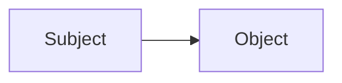
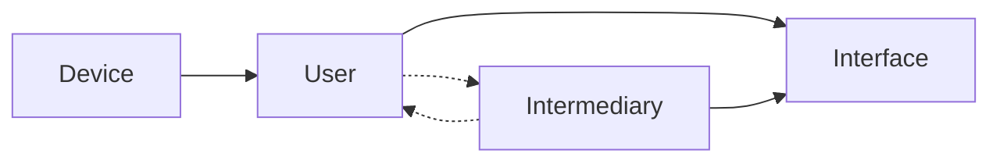

# The Clean Source Principle

## Overview

The clean source principal states that `The security of a system is only as strong as the weakest link in the chain`. 
This means that if any up stream component of a system is compromised, it can potentially compromise any downstream (dependant) system.

The clean source principle is frequently applied in privileged security architecture, and is called by its slang name `clean keyboard`. 
The clean keyboard is critical to ensure that a privileged user is not compromised and can be trusted to access downstream systems.
The physical keyboard that is used by the privileged user has to be secured and attested to ensure that all downstream systems are not compromised by something as trivial as a rubber ducky or pineapple device.

The clean source principal is directly responsible for creating the concept of the PAW (Privileged Access Workstation).
This device is a device that is locked down from the chipset level, all the way up to the user experience.

!!!Example "Phishing Attack"
    If a user account is compromised, a threat actor can use that account to gain access to downstream systems (interfaces) and action upon objective.

!!!Example "Jump Box"
    A "secure" jump box/session host (like a PAM) is used to access downstream systems.

    If the device accessing the jump box is compromised, a threat actor can wait until the user logs into the jump box and then use that session to access downstream systems.
    This is called a session hijack and is a common attack vector for threat actors to bypass PAMs.

## Clean Source Visualized

Core concept of clean source, up stream makes all items downstream at max, the same security level as up stream.

A more practical example demonstrating that device and user up stream affects the overall security of the interface down stream.

## See Also

- [Microsoft - Clean Source Principle](https://aka.ms/cleansource){:target="_blank"}
