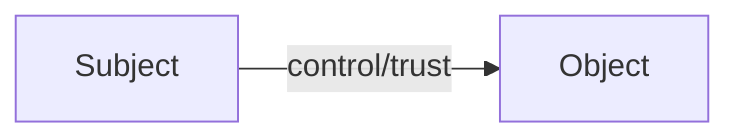
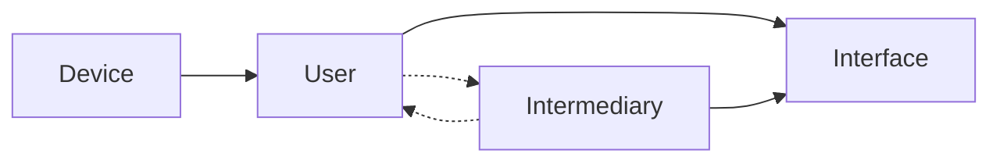

# The Clean Source Principle

## Overview

The clean source principle states that `The security of a system is only as strong as the weakest link in the chain`. 
This means that if a threat actor compromises any upstream component of a system, it can potentially compromise any downstream (dependent) system.

The clean source principle is frequently applied in privileged security architecture and is called by its slang name `clean keyboard` in the privileged security community. 
The clean keyboard is critical to ensure that a privileged user is not compromised and can be trusted to access downstream systems.
The physical keyboard that is used by the privileged user must be secured and attested to ensure that all downstream systems are not compromised by something as trivial as a rubber ducky or pineapple device.

The clean source principle is responsible for creating the concept of the PAW.
This device is a device that is locked down from the chipset level, all the way up to the user experience.

!!!Example "Phishing Attack"
    If a user account is compromised, a threat actor can use that account to gain access to downstream systems (interfaces) and action upon objective.

!!!Example "Jump Box"
    A "secure" jump box or session host (like a PAM) is used to access downstream systems.

    If the device accessing the jump box is compromised, a threat actor can wait until the user logs into the jump box and then uses that session to access downstream systems.
    This is called a session hijack and is a common attack vector for threat actors to bypass PAMs.

## Clean Source Visualized

### Core Concept

The core concept of clean source is that items upstream make all items downstream, at maximum, the same security level as upstream.

!!!note "Does Not Have to Be RCE"
    Keyboard and mouse are considered control. It does not matter how many jump boxes you have, the same hardware keyboard and mouse are used to control all downstream systems.
    If the keyboard and/or mouse are compromised, all downstream systems are compromised by the logical control/trust relationship between the entities.
    
    The physical HIDs do not themselves have to be compromised, the device can have a C2 agent that can intercept and modify the input from the keyboard and mouse, which is enough to compromise all downstream systems.

### Infrastructure Context

A more practical example demonstrates that devices and users upstream affect the security of downstream systems.

## See Also

- [Microsoft - Clean Source Principle](https://aka.ms/cleansource){:target="_blank"}
