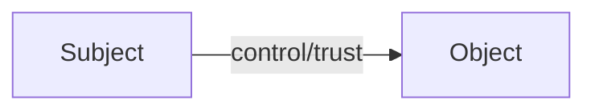
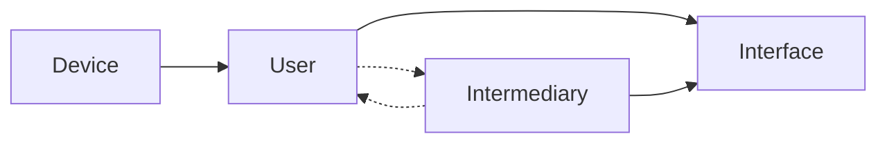
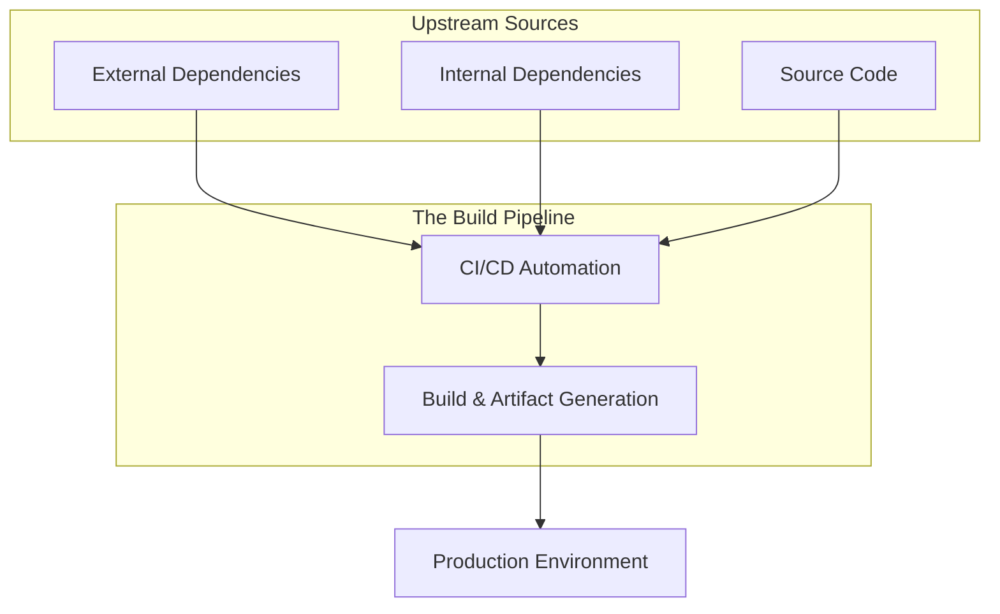

# The Clean Source Principle

## Overview

The clean source principle states that `The security of a system is only as strong as the weakest link in the chain`. 
This means that if a threat actor compromises any upstream component of a system, it can potentially compromise any downstream (dependent) and integrated systems.

The clean source principle can be applied to any system, and is often applied in the following contexts:

- Identity and access management.
- Software supply chain security.

In the privileged security community, it is called `clean keyboard` as tech slang.

!!!info "Does Not Have to Be RCE"
    Keyboard and mouse are considered control. It does not matter how many jump boxes you have, the same hardware keyboard and mouse are used to control all downstream systems.
    If the keyboard and/or mouse are compromised, all downstream systems are compromised by the logical control/trust relationship between the entities.
    
    The physical HIDs do not themselves have to be compromised, the device can have a C2 agent that can intercept and change the input from the keyboard and mouse, which is enough to compromise all downstream systems.

## Infrastructure and Identity (Clean Keyboard)

In privileged security architecture, the "clean keyboard" ensures that the human-to-machine interface is untainted.

The physical keyboard used by a privileged user must be secured and attested to ensure downstream systems are not compromised by HID attacks like "Rubber Ducky" or "Bash Bunny" devices. 
This concept is the foundation for PAW, a device secured from the chipset level up to the user experience.

!!!example "Example: Session Hijack"
    "Secure" jump boxes/session hosts (like available in PAMs) are used to access downstream systems.
    If the device accessing the jump box is compromised, a threat actor can intercept the session to access downstream systems.
    This is a failure of clean source at the hardware/input level.

!!!note "The HID Risk"
    Physical HIDs do not have to be compromised themselves; an attacker can use a device with a C2 agent to intercept and change input from a legitimate keyboard, compromising all downstream systems via logical control.

## Software Engineering (Clean Pipeline)

Expanding the principle to software, "Upstream" includes everything that contributes to the final production artifact: OSS/external dependencies, internal packages, build pipelines, and release automation.

Protecting the software supply chain requires ensuring that no code reaches production without rigorous, identity-verified, and auditable checks.

### Key Upstream Components

- Dependencies: If a package/library is "typo squatted" or compromised, every downstream application using it inherits that compromise.
- Build Pipelines (CI/CD): The automation that assembles code. A compromised pipeline can inject malicious payloads during the build process, even if the source code itself stays "clean".
- SBOM: A critical tool for clean source, it provides the "ingredients list" to verify the integrity of all upstream components.

!!!example "Example: Dependency Confusion"
    An attacker publishes a malicious package with the same name as an internal company package to a public repository.
    If the build system pulls from the public repo first, the "clean source" is compromised during the assembly phase.

## Clean Source Visualized

### Core Concept

The core concept of clean source is that items upstream make all items downstream, at maximum, the same security level as upstream.

### Infrastructure Diagram

A more practical example demonstrates that devices and users upstream affect the security of downstream systems.

### Supply Chain Diagram

Visualization of the relationship between components in the software supply chain.

## See Also

- [Microsoft - Clean Source Principle](https://aka.ms/cleansource){:target="_blank"}
- [SLSA](https://slsa.dev){:target="_blank"}
