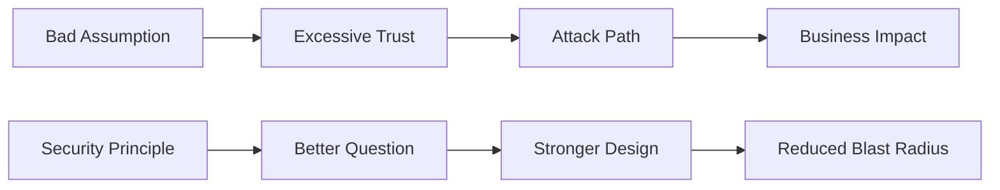

## Overview

Most security failures do not happen because nobody bought enough tools.

They happen because someone trusted the wrong thing.

- A network was assumed safe.  
- An identity was assumed legitimate.  
- A vendor was assumed responsible.  
- A privileged device was assumed clean.  
- A single control was assumed enough.  

Security principles exist to challenge those assumptions before an attacker does.

This section is not a glossary of buzzwords. It is a practical set of mental models for designing systems that are harder to compromise, easier to reason about, and more resilient when something inevitably breaks.

!!! quote "The Short Version"
    Security is not about pretending breaches will never happen.  
    It is about building systems that still make sense after one does.

## Start Here: The Principles That Change How You Think

These principles are not just for security teams. They apply to infrastructure, software, identity, cloud architecture, operations, policy, vendor management, and even physical design.

If you build, operate, approve, integrate, or depend on systems, these are for you.

-   :fontawesome-solid-arrow-down-up-lock: **Assume Breach**

    Stop designing like the perimeter is perfect.

    Assume something is already compromised, then ask the uncomfortable question:

    **What can it reach next?**

    [:octicons-arrow-right-24: Learn Why This Changes Everything](0-AssumeBreach.md){ data-preview }

-   :fontawesome-solid-layer-group: **Defense in Depth**

    One control is a speed bump.  
    Multiple independent controls are an architecture.

    Learn how to design systems where a single failure does not become a full compromise.

    [:octicons-arrow-right-24: Make Failure Survivable](1-DefenseInDepth.md){ data-preview }

-   :fontawesome-solid-handshake: **Shared Responsibility**

    The cloud did not remove your responsibility.  
    It changed where the responsibility line is drawn.

    Learn what is yours, what belongs to the provider, and why “they handle that” is not a security strategy.

    [:octicons-arrow-right-24: Find Out What Is Still Your Problem](2-SharedResponsibility.md){ data-preview }

-   :fontawesome-solid-user-secret: **Confidentiality, Integrity, and Availability**

    Security is not just about keeping secrets.

    It is also about making sure data is accurate, systems are usable, and critical information survives failure.

    [:octicons-arrow-right-24: Use CIA as a Design-Thinking Shortcut](CIA.md){ data-preview }

-   :fontawesome-solid-soap: **Clean Source**

    If the thing controlling your system is compromised, your system is compromised by proxy.

    This applies to admin workstations, keyboards, build pipelines, dependencies, automation, and anything upstream of production.

    [:octicons-arrow-right-24: Trace Trust Back to the Source](CleanSource.md){ data-preview }

-   :fontawesome-solid-eye-slash: **Security Through Obscurity**

    Security through obscurity is not useless.
    It is just usually the wrong first move.

    Learn why hiding details can add friction, but rarely changes the outcome unless stronger controls are already doing the real work.

    [:octicons-arrow-right-24: Stop Hiding Problems and Start Fixing Them](./securityThroughObscurity.md){ data-preview }

## The Uncomfortable Truth

Attackers do not care how your architecture diagram was supposed to work.

They care about trust relationships:

- They look for the identity that has too much access.  
- The device that controls too many systems.  
- The pipeline that can publish to production.  
- The SaaS provider everyone forgot to review.  
- The backup nobody tested.  
- The admin path nobody threat-modeled.  

Good security principles help you see those relationships before they become incident reports.

## The Real Goal

The goal is not to build a system that can never be breached. 
That system does not exist.

The goal is to build systems where compromise is harder, movement is slower, impact is smaller, recovery is faster, and trust is earned instead of assumed.

If that sounds useful, start with the principle that makes every other principle sharper:

Start with [Assume Breach](0-AssumeBreach.md){ data-preview }
